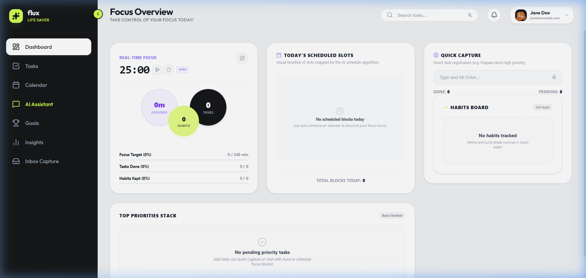
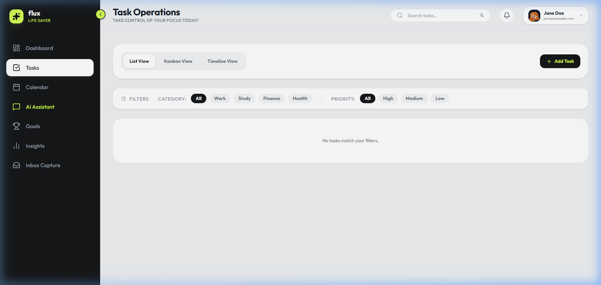
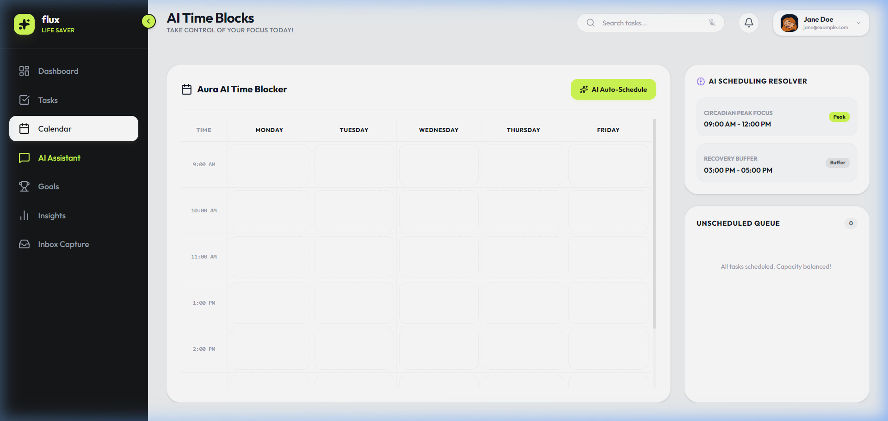
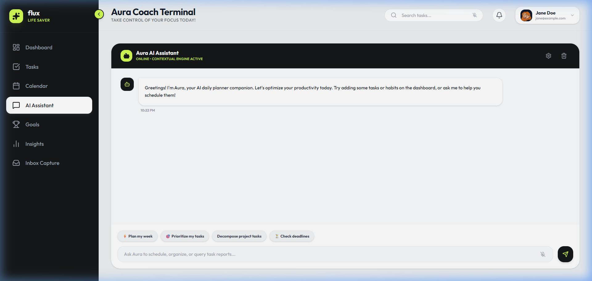
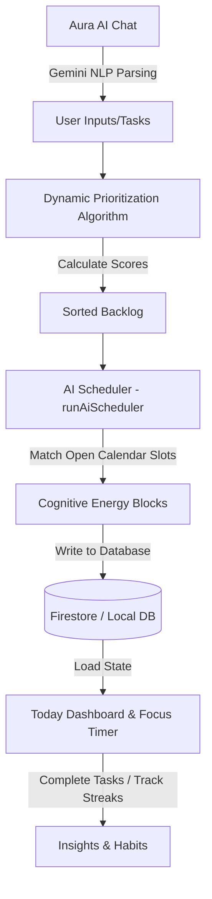

# ⚡ Zenith AI — Proactive Productivity Companion

`Zenith AI` is an AI-powered, proactive productivity companion designed to plan, prioritize, and execute tasks before deadlines. Inspired by cognitive science, it schedules tasks around personal energy rhythms, resolves calendar overlaps, and drives habit consistency.

Whether you are a developer looking to align deep-work blocks with your morning peak energy, or a student balancing assignments and exams, `Zenith AI` helps you get things done before they become emergencies.

---

## 📸 Screenshots

### 🌅 Today Dashboard
The central hub featuring a cognitive Focus Timer, daily habit check-ins with streaks, focus targets, and high-priority action items.


### 📋 Smart Tasks Manager
A comprehensive task board sorting items dynamically by an urgency-effort score, allowing easy subtask breakdown and categorization.


### 📅 Smart Calendar Schedule
A visual calendar blending user meetings and AI-suggested deep-work focus blocks based on cognitive capacity.


### 🤖 Aura AI Assistant
Your productivity co-pilot powered by the Gemini API, supporting natural language commands to schedule, adjust, and query your day.


---

## 🚀 Key Features

1. **🌅 Today Dashboard**
   * **Cognitive Focus Timer**: An interactive focus countdown to encourage timed sprints (deep-work).
   * **Habit Streaks Tracker**: Real-time habit logging with visual streak counts to build long-term consistency.
   * **Wellness & Focus Metrics**: Daily tracking of actual focus minutes versus your daily target.
   * **Daily Highlights**: Quick view of today's urgent tasks and events.

2. **📋 Priority Task Manager**
   * **Flexible Attributes**: Assign deadlines, times, estimated effort (hours), and priority levels.
   * **Subtask Tree**: Break large items into smaller checklist subtasks with individual completion tracking.
   * **Categorized Tags**: Organize by default domains: *Coding*, *Study*, *Health*, *Finance*, *Work*, or custom tags.

3. **📅 Custom Calendar Page**
   * **Integrated Timetable**: Displays standard events (meetings, buffers) alongside AI-injected Focus blocks.
   * **Interactive Controls**: Easily add, edit, and delete events directly on the calendar.
   * **Synchronized States**: Automated API endpoints to sync calendar changes instantly to the cloud or local storage.

4. **🤖 Aura AI Assistant**
   * **Natural Language Command Processing**: Understands requests such as *"add high priority task to code backend for 3 hrs by tomorrow"* using custom heuristic parsing.
   * **Proactive Scheduling**: Directly chats with you to resolve overlaps, answer productivity questions, or plan your week.
   * **Offline Fallback Engine**: If the Gemini API is offline or unconfigured, Aura seamlessly switches to an offline heuristics parser to assist you locally without disruption.

5. **📊 Insights & Analytics**
   * Performance metrics displaying streak records and focus completion rates.

---

## 🛠️ The Tech Stack

### Frontend (Single Page Application)
* **Framework**: React 19 (TypeScript)
* **Bundler & Tooling**: Vite 8
* **Styling**: TailwindCSS 4 & Vanilla CSS (modern glassmorphism, responsive grids, custom typography)
* **State Management**: Zustand 5 (configured with persistent middleware to survive page refreshes)
* **Animation & Icons**: Framer Motion & Lucide React

### Backend (REST API Server)
* **Runtime Environment**: Node.js & Express
* **Production Database**: Firebase Admin SDK & Cloud Firestore
* **Development Fallback**: Local JSON database (`local-db.json`) for zero-configuration, offline development
* **Authentication & Security**: JSON Web Tokens (JWT) for session persistence, Bcryptjs for password hashing, and Google OAuth Integration
* **API Integration**: Gemini API for generative AI assistant functionalities

---

## 🧠 Under the Hood: Prioritization & AI Scheduling

### 1. Dynamic Prioritization Algorithm
Every task is assigned an automated **Priority Score** (from `0` to `100`) calculating its relative urgency, importance, and effort. 

The score is calculated as follows:
* **Urgency ($U$) [50% Weight]**: Based on the number of days remaining to the deadline:
  * Overdue or due today: `100` points
  * Due tomorrow: `90` points
  * Due within 3 days: `75` points
  * Due within 7 days: `50` points
  * Due further out: Decays by `5` points per day, down to a minimum of `10`.
* **Importance ($I$) [40% Weight]**: Defined by the manual priority flag:
  * `High`: `90` points
  * `Medium`: `50` points
  * `Low`: `20` points
* **Effort Weight ($E$) [Bonus up to 20 points]**: Larger tasks (estimated effort hours) are pushed forward if their deadlines are approaching:
  $$\text{Effort Weight} = \min(20, \text{Effort Hours} \times 2)$$

$$\text{Priority Score} = \min\left(100, \text{round}\left(U \times 0.5 + I \times 0.4 + E\right)\right)$$

### 2. Cognitive Energy-Based Scheduling
When clicking **Run AI Scheduler**, the application runs a scheduling loop that:
1. Gathers all incomplete tasks, sorting them by **Priority Score** (highest first).
2. Traverses weekdays (Monday to Friday) and searches for open hours (9:00 AM - 4:00 PM, skipping lunch hours).
3. Inserts a `Focus` event in the calendar for the task, setting:
   * **Morning Hours (9 AM - 12 PM)**: **Peak energy (Deep Work)** blocks
   * **Midday Hours (1 PM - 3 PM)**: **Medium energy (Collaboration)** blocks
   * **Afternoon Hours (3 PM - 5 PM)**: **Low energy (Administrative)** blocks
4. Automatically updates the tasks' schedule metadata and synchronizes them with the backend database.

---

## 🔄 Development Workflow



---

## ⚡ Installation & Setup

Follow these steps to run `Zenith AI` locally:

### 📋 Prerequisites
* [Node.js](https://nodejs.org/) (v18 or higher recommended)
* `npm` or `yarn`

### 🔧 Step 1: Clone the Repository & Install Dependencies
1. Navigate to the project root and install frontend dependencies:
   ```bash
   npm install
   ```
2. Navigate to the backend directory and install backend dependencies:
   ```bash
   cd backend
   npm install
   ```

### 🔑 Step 2: Configure Environment Variables
In the `backend` directory, create a `.env` file containing:
```env
PORT=5000
JWT_SECRET=your_jwt_secret_key_here
GEMINI_API_KEY=your_gemini_api_key
GOOGLE_CLIENT_ID=your_google_oauth_client_id
```

> [!NOTE]
> If you do not have a Google Client ID, the application will automatically offer a mock signup/login flow so you can test it immediately.
> If no `firebase-service-account.json` file is present in the `backend/` directory, the backend automatically sets up a local JSON database (`local-db.json`) for data persistence.

### 🏃 Step 3: Run the Application
1. **Start the Backend server**:
   ```bash
   cd backend
   npm run dev
   ```
   *The server runs on [http://localhost:5000](http://localhost:5000)*.

2. **Start the Frontend development server**:
   In a separate terminal, run:
   ```bash
   npm run dev
   ```
   *The application will open on [http://localhost:5173](http://localhost:5173)*.

---

## 🧑‍💻 Creator & License
Created as an intelligent agentic productivity ecosystem. Feel free to explore the code, customize the scheduler heuristics, or extend Aura's AI features!
